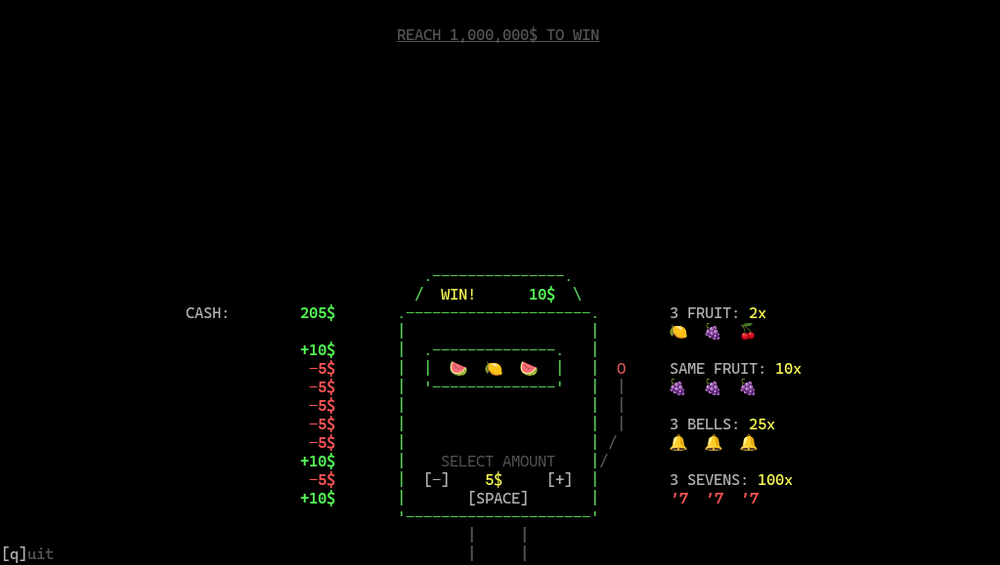

# odin-casino

I wanted to know if the slot machine from _Schedule I_ was profitable on average (it is), also wanted to learn how to make console games

## Resources used:

- Cooking/uncooking the terminal: https://zig.news/lhp/want-to-create-a-tui-application-the-basics-of-uncooked-terminal-io-17gm
- ANSI cheat sheet: https://gist.github.com/fnky/458719343aabd01cfb17a3a4f7296797
- Odin's ANSI constants: https://github.com/odin-lang/Odin/blob/master/core/encoding/ansi/ansi.odin
